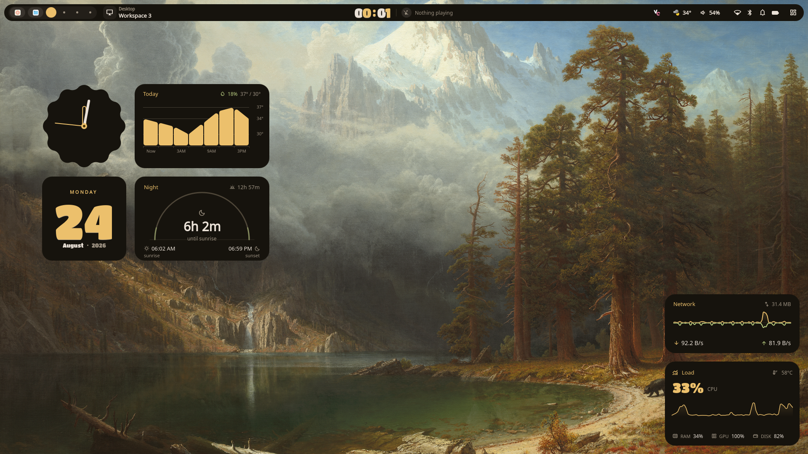
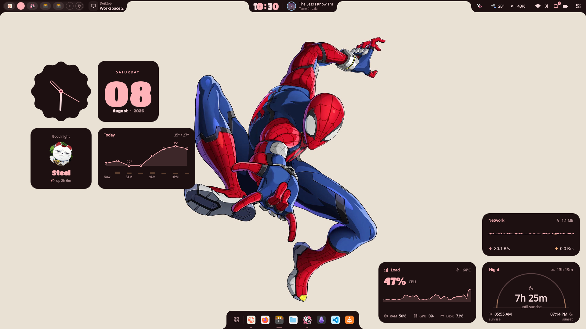

<div align="center">

# Nebula

*A dreamy desktop shell for Hyprland, built with Quickshell*

<br/>

[](https://github.com/iamSt3el/Nebula/stargazers)
[](LICENSE)
[](https://quickshell.outfoxxed.me)

</div>

---

## Preview

<div align="center">

[](https://youtu.be/bYuwrP-WTCs)

<br/>



<sub><b>Dashboard</b> — sliders, quick toggles, power profiles, and the grouped notification shade</sub>

<br/><br/>



<sub><b>Widget screen</b> — clock, date, weather, system load, network, and sun times, all themed from the wallpaper</sub>

</div>

---

## Features

### Shell

- **Bar** — workspaces, system tray, clock, weather, battery, notifications, bluetooth, wifi, VPN, and media controls. Pill or full-width mode.
- **Secondary bar** — a slimmer bar for your other monitors, with per-monitor workspaces
- **Dashboard** — profile, brightness and volume sliders, wifi / bluetooth / power-profile panels, quick actions, notifications, and a calendar
- **Notification shade** — Android-style grouped notifications: groups expand in place, children swipe to dismiss individually, and a shelf collects anything scrolled below the fold
- **Overview** — workspace overview with window previews
- **Dock** — application dock with hover previews and a right-click menu
- **OSD** — brightness and volume overlay on key press
- **Lock screen** — blurred wallpaper with clock, date, media controls, and profile avatar
- **Shutdown window** — shutdown, reboot, suspend, logout, and lock

### App launcher

One launcher, five modes, switched by a prefix:

| Prefix | Mode | Example |
|--------|------|---------|
| *(none)* | Applications — fuzzy search, pinning, categories | `firefox` |
| `=` | Calculator + unit conversion (libqalculate) | `1920*0.15` · `100 usd to inr` |
| `>` | Run a shell command | `>systemctl suspend` |
| `:` | Emoji picker | `:fire` · `:rocket` |
| `w` | Switch to an open window | `w term` |

### Widgets

A full-screen widget canvas with a large collection to arrange:

- **Clocks** — analog (classic, minimal, shaped) and digital (column, echo, outline, pair, slab, stacked, thin, ticker)
- **Dates** — accent, bold, calendar, ghost, inline, pill, split
- **Weather** — details, forecast, slanted, hourly, wind, barometer
- **System** — monitor (full, compact, pulse), network graph, battery (bar, minimal, ring), temperature
- **Media** — music player, circular player, album art, CAVA spectrum
- **Other** — sticky notes, task list, pomodoro timer, RSS headlines, moon phase, sun arc, profile cards

### Tools

- **AI assistant** — a chat panel that drives [claude.ai](https://claude.ai) through a bundled browser extension, with optional voice dictation. See [AI setup](#ai-setup).
- **Clipboard manager** — full history with image previews, powered by cliphist
- **Screenshot** — full screen, active window, or region, via grimblast, with swappy annotation
- **Screen recording** — region or full-screen via a native wf-recorder plugin, with a live status pill
- **Wallpaper selector** — browse local folders or search Wallhaven; animated transitions via awww
- **Material You theming** — colours extracted from your wallpaper, dark and light
- **Music visualizer** — real-time CAVA frequency bars
- **Game mode** — one toggle to quiet the shell while you play
- **Cheat sheet** — an on-screen keybinding reference
- **Typing game** — a small typing test, because why not
- **Settings panel** — theme, appearance, sound, media, networking, bluetooth, notifications, weather, widgets, sleep, keybindings, and AI

---

## Keybindings

Nebula registers global shortcuts that Hyprland dispatches to the shell. Add binds in your Lua keybindings file (e.g. `~/.config/hypr/lua/keybinds.lua`):

```lua
-- Pick whatever keys work for you
hl.bind("SUPER + L",             hl.dsp.global("quickshell:lock"),              { locked = true })
hl.bind("SUPER + SHIFT + S",     hl.dsp.global("quickshell:shutdown"),          { locked = true })
hl.bind("SUPER + CTRL + RETURN", hl.dsp.global("quickshell:appLauncher"))
hl.bind("SUPER + TAB",           hl.dsp.global("quickshell:overview"))
hl.bind("SUPER + V",             hl.dsp.global("quickshell:clipboard"))
hl.bind("SUPER + S",             hl.dsp.global("quickshell:toolsWidget"))
hl.bind("SUPER + W",             hl.dsp.global("quickshell:wallpaperLauncher"))
hl.bind("SUPER + CTRL + S",      hl.dsp.global("quickshell:settingOpen"))
hl.bind("SUPER + D",             hl.dsp.global("quickshell:ai"))
hl.bind("SUPER + SHIFT + D",     hl.dsp.global("quickshell:aiHistory"))
hl.bind("SUPER + SLASH",         hl.dsp.global("quickshell:cheatsheet"))
hl.bind("SUPER + T",             hl.dsp.global("quickshell:typingGame"))

-- Brightness (works on laptop panels and DDC/CI monitors)
hl.bind("XF86MonBrightnessUp",   hl.dsp.global("quickshell:brightnessIncrease"))
hl.bind("XF86MonBrightnessDown", hl.dsp.global("quickshell:brightnessDecrease"))
```

The `{ locked = true }` flag lets a bind fire even when the screen is locked.

Using a classic `hyprland.conf` instead? The equivalents live in [`config/hypr/nebula.conf`](config/hypr/nebula.conf).

> [!NOTE]
> The dashboard, notification shade, and weather panel are opened from the bar
> rather than by shortcut.

---

## Installation

### One-line install

```bash
bash <(curl -fsSL https://raw.githubusercontent.com/iamSt3el/Nebula/master/install.sh)
```

The script:

1. Installs an AUR helper (`yay`) if you don't have one
2. Installs the required pacman and AUR packages
3. Clones Nebula to `~/.config/quickshell` (or updates it if already there)
4. Installs `uv` and creates the Python environment at `~/.local/state/quickshell/.venv`
5. Downloads the Rubik font
6. Builds the emoji index for the launcher's `:` mode
7. Builds the WfRecorder screen-recording plugin
8. Enables the pipewire / NetworkManager / bluetooth / upower services
9. Adds `NEBULA_VENV` and `QML_IMPORT_PATH` to your shell profile (bash / zsh / fish)
10. Installs the matugen templates used for music and Hyprland colours

Flags: `-f` / `--force` to skip every confirmation, `-s` / `--skip-sysupdate` to skip `pacman -Syu`.

> [!IMPORTANT]
> **The installer does not touch your Hyprland config.** It installs the shell and
> nothing else — you wire up autostart and keybinds yourself, see below.

> [!NOTE]
> Requires Arch Linux (uses `pacman`).

---

### Hyprland setup

Add the autostart entries to your Hyprland config by hand.

**Classic `hyprland.conf`:**

```ini
exec-once = awww-daemon
exec-once = wl-paste --watch cliphist store
exec-once = QSG_RENDER_LOOP=threaded quickshell

env = QML_IMPORT_PATH,$HOME/.local/lib/qt6/qml
env = NEBULA_VENV,$HOME/.local/state/quickshell/.venv
```

**Lua config (Hyprland ≥ 0.55):** copy the ready-made snippets into your own files —
[`config/hypr/nebula-autostart.lua`](config/hypr/nebula-autostart.lua) and
[`config/hypr/nebula-environment.lua`](config/hypr/nebula-environment.lua):

```lua
-- lua/autostart.lua
hl.exec_cmd("awww-daemon")
hl.exec_cmd("wl-paste --watch cliphist store")
hl.exec_cmd("QSG_RENDER_LOOP=threaded quickshell")

-- lua/environment.lua
hl.env("QML_IMPORT_PATH", os.getenv("HOME") .. "/.local/lib/qt6/qml")
hl.env("NEBULA_VENV",     os.getenv("HOME") .. "/.local/state/quickshell/.venv")
```

A complete reference config is in [`config/hypr/`](config/hypr/) if you'd rather copy
it wholesale — edit `lua/monitor.lua` to match your outputs.

---

### Dependencies

#### System packages

| Package | Purpose |
|---------|---------|
| [Quickshell](https://quickshell.outfoxxed.me) (`quickshell-git`) | Shell framework |
| `hyprland` | Wayland compositor |
| `qt6-base` `qt6-declarative` `qt6-wayland` `qt6-svg` `qt6-multimedia` | Qt runtime |
| `pipewire` + `wireplumber` + `libpipewire` | Audio backend |
| `networkmanager` (`nmcli`) | Network management |
| `bluez` + `bluez-utils` | Bluetooth |
| `upower` | Battery info |
| [awww](https://github.com/danyspin97/awww) (`awww-git`) | Wallpaper setter with transitions |
| `grim` + `grimblast-git` | Screenshot capture |
| `swappy` | Screenshot annotation |
| `wf-recorder` | Screen recording |
| `wl-clipboard` | Clipboard operations |
| `cliphist` | Clipboard history |
| `cava` | Audio visualizer |
| `brightnessctl` | Screen brightness |
| `libqalculate` (`qalc`) | Launcher calculator and unit conversion |
| `matugen-bin` | Music and Hyprland colour templates |
| `curl` + `unzip` | Weather, news, and font download |
| `python` | Colour engine, emoji index, AI bridge |
| `gcc` `cmake` `extra-cmake-modules` | Building the WfRecorder plugin |

> `ddcutil` is optional — external monitor brightness over DDC/CI.
> `hyprlock` / `hypridle` are optional — the installer offers them.

#### Python environment

Managed with [uv](https://github.com/astral-sh/uv) and kept out of the repo at
`~/.local/state/quickshell/.venv`, which the shell finds via `NEBULA_VENV`:

```bash
uv venv --prompt nebula ~/.local/state/quickshell/.venv -p 3.12
uv pip install materialyoucolor requests Pillow \
  --python ~/.local/state/quickshell/.venv/bin/python
```

`faster-whisper` is only needed if you want voice dictation in the AI panel.

#### Fonts

| Font | Source |
|------|--------|
| [Material Symbols Rounded](https://fonts.google.com/icons) | `ttf-material-symbols-variable-git` (AUR) |
| [Rubik](https://fonts.google.com/specimen/Rubik) | Downloaded directly by the installer |

---

### Manual setup

```bash
# Build and install the WfRecorder plugin
bash ~/.config/quickshell/plugins/WfRecorder/build.sh

# Make Qt find the plugin, and the shell find its venv
export QML_IMPORT_PATH="$HOME/.local/lib/qt6/qml:$QML_IMPORT_PATH"
export NEBULA_VENV="$HOME/.local/state/quickshell/.venv"

# Launch
QSG_RENDER_LOOP=threaded quickshell
```

> [!NOTE]
> Add both exports to your shell profile so they persist, and make sure a Hyprland
> session is running before launching.

---

## AI setup

The AI panel doesn't call an API — it drives a real [claude.ai](https://claude.ai)
session in a browser, so it uses your existing subscription and needs no key.

It talks to the browser through the WebExtension in [`extension/`](extension/):

```bash
bash ~/.config/quickshell/extension/build.sh
```

Then load the built extension in [Zen](https://zen-browser.app) via *Install Add-on
From File* and open claude.ai.

> [!IMPORTANT]
> Zen is required. The extension is unsigned, which Zen allows with
> `xpinstall.signatures.required=false` in `about:config`, but stock Firefox does not.

Voice dictation is optional. Install `faster-whisper` into the venv and the panel
gains push-to-talk; without it, typing still works.

---

## Configuration

Settings live at `~/.cache/quickshell/settings.json` and are edited through the
built-in **Settings panel**.

| Section | Options |
|---------|---------|
| **General** | Bar mode (pill / full), profile picture, display font, dock, music visualizer, motion scheme (expressive / standard) |
| **Theme** | Wallpaper directory, dark / light, colour algorithm, transition type |
| **Widgets** | Which widgets appear on the widget screen, news feed URL and refresh |
| **Weather** | Location (city or `lat,lon`), units, refresh interval |
| **Notifications** | Popup behaviour, timeouts, do-not-disturb |
| **Recording / Screenshot** | Output directory, format, region defaults |
| **Sleep** | Idle and lock timings |
| **Game mode** | What gets suppressed while gaming |
| **AI** | Bridge and dictation settings |
| **Wallhaven** | API key for online wallpaper search |

---

## Credits

| Person | Why |
|--------|-----|
| [end_4](https://github.com/end-4) | Inspiration, Quickshell patterns, and [rounded-polygon-qmljs](https://github.com/end-4/rounded-polygon-qmljs) (bundled in `modules/MatrialShapes`) |
| [soramane](https://github.com/soramanew) | Design inspiration |
| [outfoxxed](https://outfoxxed.me/) | Creator of [Quickshell](https://quickshell.outfoxxed.me) |

---

## License

Nebula is free software, licensed under the [GNU General Public License v3.0](LICENSE).

Copyright © 2026 iamSt3el

`modules/MatrialShapes/` is [rounded-polygon-qmljs](https://github.com/end-4/rounded-polygon-qmljs)
by end_4, included under the [Apache License 2.0](modules/MatrialShapes/LICENSE) and
retained under its original terms.

---

<div align="center">
  <sub>made with ♥ and too many late nights</sub>
</div>
